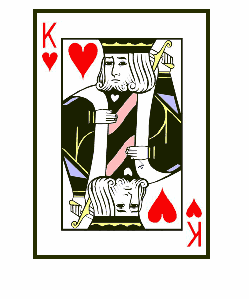
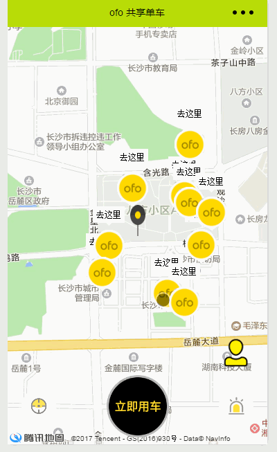

    <big>
	    h5 实训案例
	</big>

# 360网站案例 #

360 浏览器的宣传页面，大屏幕展示，整屏幕的宣传页，每切换一页就会产生动画效果。

## 效果展示 ##

## 训练知识点 ##

1. 小图标的制作
2. CSS3 动画原理
3. JS 分屏插件

# Poke翻牌 #
点击扑克，360度旋转，动画效果翻牌

## 效果展示 ##

## 训练知识点 ##

1. 扑克牌的制作
2. CSS3中3D旋转知识点
3. JS添加样式功能

# Photo照片放大器 #
通过下方的滑动条，可以做到缩放图片效果

## 效果展示 ##

## 训练知识点 ##
1. H5 中画布画图知识点
2. JS 中函数
3. 移动放大计算功能

# ofo共享单车 #

移动端程序。采用 微信小程序 实现，能够模拟单车的出现位置

## 效果展示 ##

## 训练知识点 ##

1. 移动app中的图标制作
2. 微信小程序地图组件的使用
3. 微信小程序用户登录的信息获取
4. 微信小程序的注册及发布

